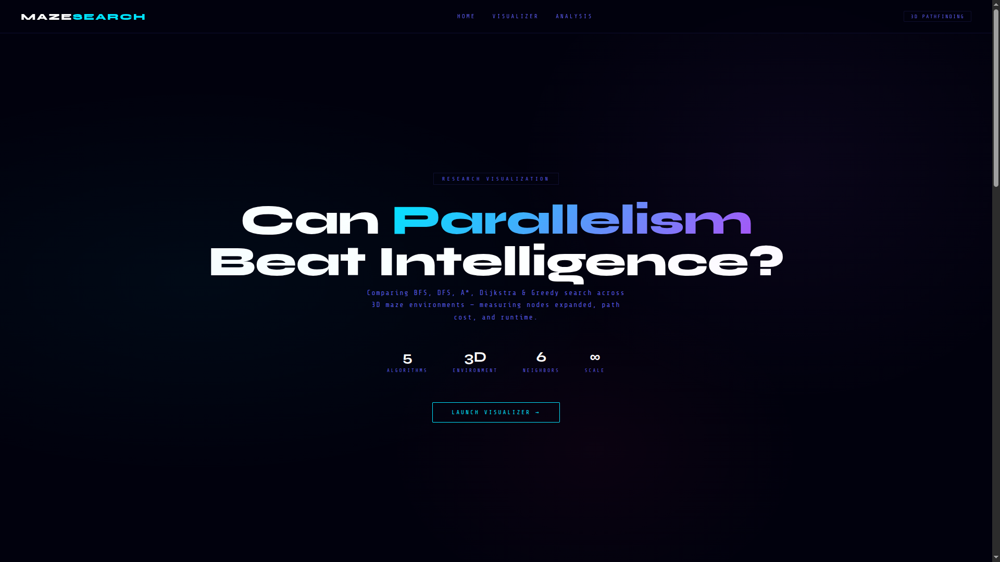
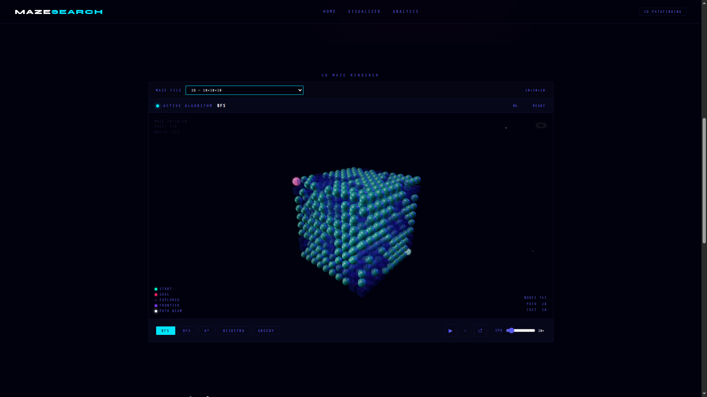
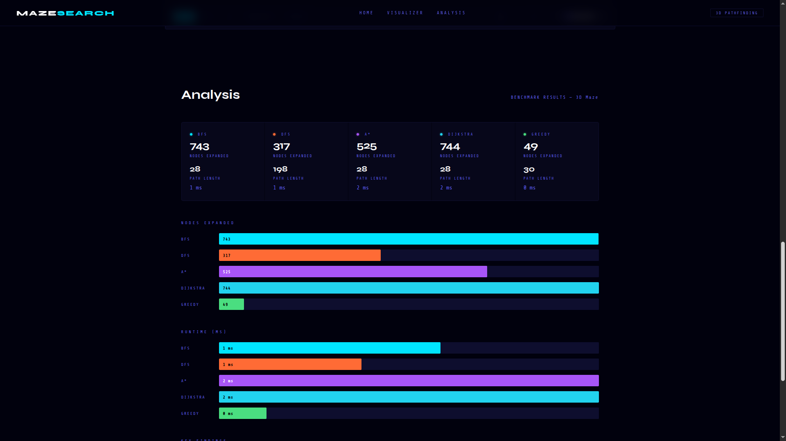

# Maze Search Benchmark

An experimental project comparing uninformed and informed search algorithms on procedurally generated mazes. The central question is whether massive parallelism and raw computational power can rival or surpass heuristic-guided intelligence — and under what conditions that holds.

---

## The Question

Classical informed search algorithms like A* and Dijkstra are efficient by design. They use domain knowledge to guide their search toward the goal, expanding far fewer nodes than uninformed alternatives. BFS, by contrast, expands everything — blindly, level by level, in every direction.

But BFS has a structural property that A* and Dijkstra do not: its frontier nodes are independent of each other. Every node at level L can be explored simultaneously without affecting the correctness of the search. This makes BFS a natural candidate for massive parallelization.

The experiment asks: if you give BFS enough threads, does raw computational power compensate for the lack of intelligence? And if so, how much power does it take?

---

## Research Phases

### Phase 1 — Threshold Investigation
Before committing to parallel implementation, we establish whether parallelism is even worth pursuing. This phase measures the node expansion ratio between BFS and its informed relatives, and estimates the break-even thread count — the number of threads BFS would need to match A* in wall-clock time. If that number is unreasonably large, the parallel approach is dropped.

### Phase 2 — Sequential Baseline
A fair comparison requires clean sequential implementations of all algorithms under a uniform interface.

### Phase 3 — Parallel BFS
If Phase 1 justifies the effort, BFS is implemented in CUDA/C++ to exploit GPU parallelism. Each frontier level becomes a parallel work unit. The CUDA implementation is then benchmarked against the sequential informed algorithms across a range of maze configurations.

### Phase 4 — Adaptive Heuristics
A* is given the ability to learn. Using lightweight regression on solved mazes, the heuristic is trained to better estimate distance-to-goal from local features. This introduces adaptability into the informed side of the comparison and raises a deeper question: how much experience does A* need before a learned heuristic outperforms a hand-crafted one, and can Parallel-BFS keep up as A* improves?

### Phase 5 — Stress Testing and Extended Experiments
Both approaches are tested under adversarial conditions: high obstacle density, non-square grids, off-corner start and goal positions, narrow corridors, and open rooms.

---

## Algorithms

| Algorithm | Type | Parallelism |
|---|---|---|
| BFS | Uninformed | Yes — frontier nodes are independent |
| Dijkstra | Uninformed (weighted) | No — global priority queue dependency |
| A* | Informed | No — global ordering constraint |
| Parallel BFS | Uninformed | CUDA — one thread per frontier node |
| A* (learned heuristic) | Informed + adaptive | No |

---

## Metrics

Every algorithm run produces the following measurements:

- **Cells explored** — total nodes expanded during the search
- **Path length** — number of cells in the solution path
- **Runtime** — wall-clock time in milliseconds
- **Frontier width over time** — size of the frontier at each step, the primary parallelism signal
- **Peak frontier width** — maximum parallelism available in a single step
- **Parallel efficiency** — ratio of actual work to theoretical maximum if all levels were fully parallel
- **Break-even thread count** — estimated threads needed for BFS to match A* in time

---

## Maze Generation

Mazes are procedurally generated 2D grids using random cell assignment followed by a carving pass that guarantees a valid path from start to goal. A BFS connectivity check is run after generation to assert reachability.

Each maze is parameterized by:

- Width and height
- Wall density (probability a cell is a wall)
- Start and goal positions
- Random seed

The seed ensures reproducibility — the same seed always produces the exact same maze, making cross-algorithm comparisons fair and results independently verifiable.

---

## Project Structure

```
maze-search-benchmark/
├── main.py
├── README.md
├── requirements.txt
├── CMakeLists.txt
│
├── Prototype/
│   ├── Environment/
│   │   ├── maze_generation.py
│   │   ├── dynamic_environment.py
│   │   └── visualization.py
│   │
│   ├── Uniformed_Algorithms/
│   │   └── bfs.py
│   │
│   ├── Informed_Algorithms/
│   │   ├── dijkstra.py
│   │   └── astar.py
│   │
│   └── Experiments/
│       ├── benchmark_runner.py
│       ├── metrics.py
│       ├── parameters.py
│       └── config.py
│
├── cpp/
│   ├── include/
│   ├── src/
│   └── cuda/
│       └── parallel_bfs.cu
│
├── notebooks/
│   ├── 01_maze_generation.ipynb
│   ├── 02_algorithm_prototypes.ipynb
│   ├── 03_dynamic_environment.ipynb
│   └── 04_results_analysis.ipynb
│
├── data/
│   ├── mazes/
│   └── results/
│
└── scripts/
    ├── run_python_benchmarks.py
    └── run_cpp_benchmarks.sh
```

---
## Visualization
### Interface



### 3D Modeling 



### Analytical Dashboard



---
## Setup

<!-- Fill this in later -->

**Requirements**

- Python 3.11+
- CUDA Toolkit (for parallel BFS phase)
- A C++17 compatible compiler

**Python environment**

```bash
# create virtual environment
python -m venv venv

# activate — Windows
venv\Scripts\activate

# activate — Mac/Linux
source venv/bin/activate

# install dependencies
pip install -r requirements.txt
```

**Running the benchmark**

```bash
python main.py
```


---

## Key Observations So Far


---

## Further Questions Under Investigation


---

## Notes

This is a student research prototype. The Python implementation serves as the validated baseline. The C++/CUDA implementation will follow once the experimental design is finalized and the sequential results are confirmed.
